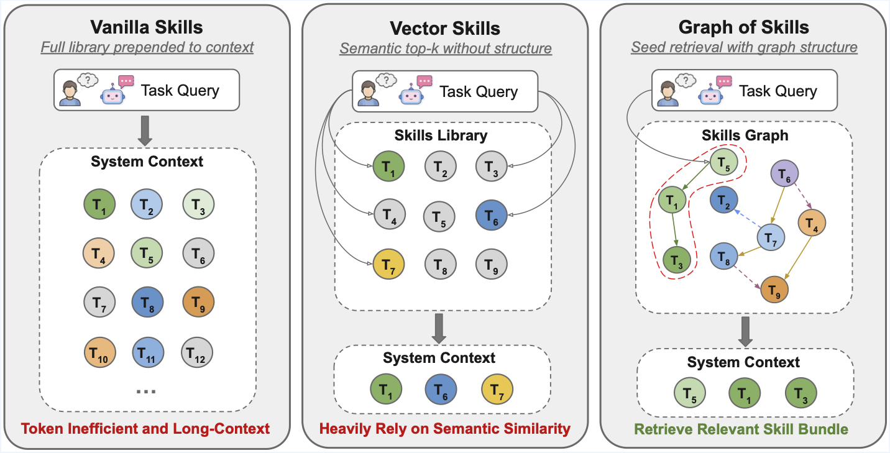
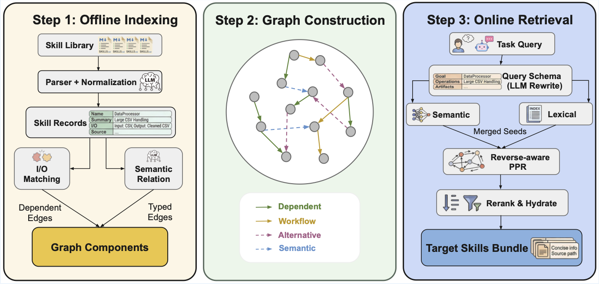

<h1 align="center">Graph of Skills (GoS)</h1>

<p align="center">
  <strong>Dependency-Aware Structural Retrieval for Massive Agent Skills</strong>
</p>

<p align="center">
  <a href="https://davidliuk.github.io/"><strong>Dawei Liu</strong></a><sup>*</sup> &middot; 
  <a href="https://zli12321.github.io/"><strong>Zongxia Li</strong></a><sup>*</sup> &middot; 
  <a href="https://hongyang-du.github.io/"><strong>Hongyang Du</strong></a> &middot; 
  <a href="https://wuxiyang1996.github.io/"><strong>Xiyang Wu</strong></a> &middot; 
  <strong>Shihang Gui</strong></a> &middot; 
  <strong>Yongbei Kuang</strong></a> &middot; 
  <a href="https://lichao-sun.github.io/"><strong>Lichao Sun</strong></a>
</p>

<p align="center">
  <a href="https://arxiv.org/abs/2604.05333"></a>
  <a href="https://huggingface.co/papers/2604.05333"></a>
  <a href="https://huggingface.co/datasets/DLPenn/graph-of-skills-data"></a>
  <a href="LICENSE"></a>
  <a href="https://www.python.org/downloads/"></a>
</p>

---

## 🔥 Updates

- **[2026-04-15]** Released a [Claude Code MCP plugin](skills/) for graph of skills retrieval — drop-in integration for Claude Code agents.
- **[2026-04-07]** Paper released on [arXiv:2604.05333](https://arxiv.org/abs/2604.05333) and [HuggingFace Papers](https://huggingface.co/papers/2604.05333).
- **[2026-04-06]** Code open-sourced on [GitHub](https://github.com/davidliuk/graph-of-skills).
- **[2026-04-04]** Skill libraries, prebuilt workspaces, and benchmark data released on [HuggingFace](https://huggingface.co/datasets/DLPenn/graph-of-skills-data).

---

## Overview

Graph of Skills builds a **skill graph** offline from a library of `SKILL.md` documents, then retrieves a small, ranked set of relevant skills at task time. Instead of flooding the agent context with an entire skill library, GoS surfaces only the skills most likely to help -- along with their prerequisites and related capabilities.

<p align="center">
  
</p>

## How It Works

<p align="center">
  
</p>

**Retrieval pipeline:**

1. **Seed** -- retrieve semantic candidates (embedding similarity) and lexical candidates (exact-match tokens)
2. **Merge** -- combine both candidate pools
3. **Rerank** -- rerank using the skill-graph structure (dependencies, co-occurrence)
4. **Return** -- emit a capped, agent-readable skill bundle

## Results

GoS is evaluated on **SkillsBench** (87 dockerized coding tasks) and **ALFWorld** (134 household games) across three model families. **R** = average reward (%), **T** = input tokens, **S** = runtime (s). ↑ higher is better, ↓ lower is better.

| Model | Method | SB R↑ | SB T↓ | SB S↓ | AW R↑ | AW T↓ | AW S↓ |
|-------|--------|------:|------:|------:|------:|------:|------:|
| Claude Sonnet 4.5 | Vanilla Skills | 25.0 | 967,791 | 465.8 | 89.3 | 1,524,401 | 53.2 |
| | Vector Skills | 19.3 | 894,640 | **357.3** | 93.6 | 28,407 | **37.8** |
| | **+ GoS** | **31.0** | **860,315** | 364.9 | **97.9** | **27,215** | 49.2 |
| MiniMax M2.7 | Vanilla Skills | 17.2 | 942,113 | 580.7 | 47.1 | 2,184,823 | 88.6 |
| | Vector Skills | 10.4 | **852,881** | 552.9 | 50.7 | 66,109 | 73.4 |
| | **+ GoS** | **18.7** | 867,452 | **502.5** | **54.3** | **65,227** | **68.8** |
| GPT-5.2 Codex | Vanilla Skills | 27.4 | 3,187,749 | **686.8** | 89.3 | 1,435,614 | 83.3 |
| | Vector Skills | 21.5 | **1,243,648** | 773.0 | 92.9 | **34,436** | **57.0** |
| | **+ GoS** | **34.4** | 1,379,773 | 715.6 | **93.6** | 46,462 | 64.7 |

GoS achieves the **highest reward on every model** on both benchmarks while cutting input tokens by up to **56×** (ALFWorld, Claude Sonnet 4.5) vs. Vanilla Skills. For scalability and ablation analysis, see the [paper](https://arxiv.org/abs/2604.05333).

## Citation

If you find this work useful, please cite:

```bibtex
@misc{li2026graphskillsdependencyawarestructural,
      title={Graph of Skills: Dependency-Aware Structural Retrieval for Massive Agent Skills}, 
      author={Dawei Liu and Zongxia Li and Hongyang Du and Xiyang Wu and Shihang Gui and Yongbei Kuang and Lichao Sun},
      year={2026},
      eprint={2604.05333},
      archivePrefix={arXiv},
      primaryClass={cs.AI},
      url={https://arxiv.org/abs/2604.05333}, 
}
```

## Installation

### Requirements

- Python 3.10 -- 3.12
- [`uv`](https://docs.astral.sh/uv/) (recommended) or `pip`
- An embedding API key (OpenAI, Gemini, or any OpenAI-compatible provider)

### Setup

```bash
git clone https://github.com/graph-of-skills/graph-of-skills.git
cd graph-of-skills
uv sync
cp .env.example .env   # then fill in your API keys
```

<details>
<summary><strong>Provider: OpenAI (direct)</strong></summary>

```bash
OPENAI_API_KEY=sk-...
# Use the ``openai/...`` prefix so LiteLLM targets the OpenAI API (omit OPENAI_BASE_URL).
GOS_EMBEDDING_MODEL=openai/text-embedding-3-large
GOS_EMBEDDING_DIM=3072
```
</details>

<details>
<summary><strong>Provider: OpenRouter</strong></summary>

```bash
OPENROUTER_API_KEY=<openrouter-key>
OPENAI_BASE_URL=https://openrouter.ai/api/v1
GOS_EMBEDDING_MODEL=openrouter/openai/text-embedding-3-large
GOS_EMBEDDING_DIM=3072
```
</details>

<details>
<summary><strong>Provider: Azure AI (OpenAI-compatible)</strong></summary>

```bash
OPENAI_API_KEY=<azure-api-key>
OPENAI_BASE_URL=https://YOUR-RESOURCE.services.ai.azure.com/openai/v1
# Must match your **deployment name** in Azure (not necessarily ``text-embedding-3-large``).
GOS_EMBEDDING_MODEL=openai/<your-deployment-name>
GOS_EMBEDDING_DIM=<vector-dimension-for-that-model>
```
</details>

<details>
<summary><strong>Provider: Google Gemini</strong></summary>

```bash
GEMINI_API_KEY=<your-key>
GOS_EMBEDDING_MODEL=gemini/gemini-embedding-001
GOS_EMBEDDING_DIM=3072
```
</details>

## Quick Start

**Goal:** install the package, pull the published skill libraries, build (or download) a graph workspace, then run retrieval from the shell.

**Read next:** [DATA.md](DATA.md) for every download flag and asset size; [`.env.example`](.env.example) for embedding providers. After GoS works locally, use [evaluation/README.md](evaluation/README.md) for benchmark runners and [evaluation/skillsbench/README.md](evaluation/skillsbench/README.md) for Harbor-based SkillsBench.

### Step 0: Install (once per machine)

Complete [Installation](#installation) above: clone, `uv sync`, `cp .env.example .env`, and set **embedding** (and optional LLM) keys. Indexing and retrieval load `.env` from the repo root when you use `uv run gos …`.

### Step 1: Download skill libraries

The collections **`skills_200`**, **`skills_500`**, **`skills_1000`**, **`skills_2000`** are directories of `SKILL.md` files on [HuggingFace](https://huggingface.co/datasets/DLPenn/graph-of-skills-data), **not** in git. They unpack to:

- `data/skillsets/skills_200/` … `data/skillsets/skills_2000/`

```bash
./scripts/download_data.sh --skillsets
```

This tries each archive, **skips** directories that already have files, and logs `[skip]` if an archive is not yet on the Hub. Gated datasets: `HF_TOKEN=hf_... ./scripts/download_data.sh --skillsets`. Full reference (tasks, workspaces, selective flags): **[DATA.md](DATA.md)**.

**Tiny smoke test without HuggingFace:** index the built-in folder `skills/` (only a few skills) with any `--workspace` path you like.

### Step 2: Workspace directory layout (recommended for benchmarks)

`--workspace` is where GoS stores the **indexed graph** (vectors + graph storage). Use the **same** path for `gos retrieve`, `gos status`, and `gos add`.

For **ALFWorld** and **SkillsBench** defaults, keep this mapping (see [evaluation/README.md](evaluation/README.md) and `evaluation/skillsbench/graphskills_benchmark.py`):

| Skill tree you index | Recommended `--workspace` |
|----------------------|---------------------------|
| `data/skillsets/skills_200` | `data/gos_workspace/skills_200_v1` |
| `data/skillsets/skills_500` | `data/gos_workspace/skills_500_v1` |
| `data/skillsets/skills_1000` | `data/gos_workspace/skills_1000_v1` |
| `data/skillsets/skills_2000` | `data/gos_workspace/skills_2000_v1` |

### Step 3: Get a workspace (choose one path)

**A. Build locally** (needs embedding API; duration grows with library size):

```bash
mkdir -p data/gos_workspace
uv run gos index data/skillsets/skills_200 \
  --workspace data/gos_workspace/skills_200_v1 --clear
```

Use the matching pair for other sets (e.g. `skills_1000` → `data/gos_workspace/skills_1000_v1`). **Embedding model and dimension in `.env` must stay the same** for later retrieval (see [Configuration](#configuration)).

**B. Download a prebuilt workspace** (no `gos index`; must match the embedding used to build that archive):

```bash
./scripts/download_data.sh --workspace
```

See **[DATA.md](DATA.md)** for which `gos_workspace_skills_*_v1.tar.gz` files exist on the Hub and how they map to `data/gos_workspace/`.

### Step 4: Retrieve

```bash
uv run gos retrieve "parse binary STL file, calculate volume and mass" \
  --workspace data/gos_workspace/skills_200_v1 --max-skills 5
```

### Step 5: Inspect or extend

```bash
uv run gos status --workspace data/gos_workspace/skills_200_v1
uv run gos add path/to/NEW_SKILL.md --workspace data/gos_workspace/skills_200_v1
```

### Step 6: What to run next

- **End-to-end sanity check** (retrieval + one Docker task): see the **Minimal Verification** collapsible in the [Evaluation](#evaluation) section.
- **Paper benchmarks** (ALFWorld, SkillsBench): **[evaluation/README.md](evaluation/README.md)** (overview) and **[evaluation/skillsbench/README.md](evaluation/skillsbench/README.md)** (Harbor / task generation).

## Agent Integration

### Claude Code (MCP Plugin)

GoS ships with a built-in [MCP](https://modelcontextprotocol.io/) server that gives Claude Code direct access to the skill graph. When you open this project, **Claude Code auto-discovers the server** via `.mcp.json` — no manual setup.

**Quick start:**

```bash
uv sync                              # install deps (once)
cp .env.example .env                 # fill in API keys
./scripts/download_data.sh --workspace   # download prebuilt workspaces
```

Then open the project in Claude Code. The `graph-of-skills` MCP server is ready. Ask naturally:

> "Find skills for processing 3D mesh files with GoS, then follow the skill instructions to complete the task."

Claude Code will call the GoS tools, retrieve relevant skills, and follow their instructions autonomously.

<details>
<summary><strong>Manual registration (if auto-discovery is not available)</strong></summary>

```bash
claude mcp add graph-of-skills -- uv run --directory /path/to/graph-of-skills gos-claude

# Or with an explicit workspace
claude mcp add graph-of-skills -- uv run --directory /path/to/graph-of-skills gos-claude \
  --workspace data/gos_workspace/skills_200_v1
```

</details>

**Available tools:**

| Tool | Purpose |
|------|---------|
| `search_skills` | Quick ranked summary of relevant skills for a task |
| `retrieve_skill_bundle` | Full agent-ready skill content (SKILL.md bodies, scripts, graph evidence) |
| `hydrate_skills` | Load specific skills by exact name |
| `list_skills` | Browse all indexed skills with descriptions |
| `get_skill_detail` | Full metadata, I/O schema, and graph neighbors for one skill |
| `get_skill_neighbors` | Dependency / workflow / semantic edges for a skill |
| `get_status` | Workspace stats (skill count, edge count, retrieval config) |
| `index_skills` | Build the skill graph from a directory of SKILL.md files |
| `add_skill` | Incrementally add new skills to an existing graph |

See **[CLAUDE.md](CLAUDE.md)** for the full integration guide, example workflows, and configuration.

### Docker / Container (SkillsBench)

Inside a Docker container, an agent calls `graphskills-query` with a natural-language task description and receives a bounded skill bundle:

```bash
graphskills-query "parse binary STL file and calculate mass"
```

Each returned skill includes a `Source:` path the agent can open directly:

```
Source: /opt/graphskills/skills/mesh-analysis/SKILL.md
```

Set `GOS_SKILLS_DIR` to control path rewriting, so the same workspace can be indexed on a host and queried inside a container.

## CLI Reference

| Command | Description |
|---------|-------------|
| `gos index <dir>` | Build a graph workspace from a skill directory |
| `gos add <file>` | Add a single skill to an existing workspace |
| `gos retrieve <query>` | Retrieve a ranked skill bundle for a query |
| `gos query <query>` | Compact retrieval output (for debugging) |
| `gos status` | Show workspace statistics |
| `gos experiment` | Run built-in experiment presets |
| `graphskills-query` | Agent-facing retrieval (rewrites `Source:` paths for containers) |
| `gos-server` | Start the MCP server for tool-based retrieval |
| `gos-claude` | Start the MCP server for Claude Code (auto-discovered via `.mcp.json`) |

## Configuration

All runtime settings are driven by environment variables. See [`.env.example`](.env.example) for the full template. Download paths and workspace layout on disk are documented in **[DATA.md](DATA.md)**.

| Variable | Default | Description |
|----------|---------|-------------|
| `GOS_EMBEDDING_MODEL` | `openai/text-embedding-3-large` | Embedding model for indexing and retrieval (use `openai/<deployment>` on Azure) |
| `GOS_EMBEDDING_DIM` | `3072` | Embedding dimension (must match the model output) |
| `GOS_PREBUILT_WORKING_DIR` | -- | Path to a prebuilt workspace for retrieval |
| `GOS_RETRIEVAL_TOP_N` | `8` | Maximum number of skills returned |
| `GOS_SEED_TOP_K` | `5` | Initial seed count before graph expansion |
| `GOS_MAX_CONTEXT_CHARS` | `12000` | Hard cap on total returned bundle size (chars) |
| `GOS_SKILLS_DIR` | -- | Container-side skill root (for `Source:` path rewriting) |

> **Note:** The embedding model at retrieval time **must** match the model used when the workspace was indexed.

## Evaluation

**Docs:** Start with **[evaluation/README.md](evaluation/README.md)** (all tracks, modes, env vars). For SkillsBench + Harbor only, use **[evaluation/skillsbench/README.md](evaluation/skillsbench/README.md)**. Dataset files and scripts are described in **[DATA.md](DATA.md)**.

We evaluate GoS on two benchmarks:

| Benchmark | Type | Tasks |
|-----------|------|-------|
| **ALFWorld** | Interactive household tasks | 134 games |
| **SkillsBench** | Dockerized coding tasks | 87 tasks |

For **running these evaluations**, we recommend routing the agent's chat / completion API through [OpenRouter](https://openrouter.ai/): use an OpenAI-compatible `BASE_URL` (for example `https://openrouter.ai/api/v1`) and the API key your runner documents. The GoS project's own evaluation testing is done mainly this way. Embeddings for indexing and retrieval are separate; configure them in `.env` as in [`.env.example`](.env.example) (OpenRouter, direct OpenAI, Gemini, or Azure).

Benchmark data is hosted externally and **not** included in this repository:

```bash
./scripts/download_data.sh          # download all assets (~780 MB); options in DATA.md
```

Selective downloads and workspace rebuild steps: **[DATA.md](DATA.md)**.

<details>
<summary><strong>Minimal Verification (end-to-end smoke test)</strong></summary>

**Scope:** GoS retrieval against a real workspace, then **one** [SkillsBench](evaluation/skillsbench/README.md) task in Docker via [Harbor](https://github.com/harbor-ai/harbor). This is a smoke test, not a full benchmark sweep. For all tracks, see [evaluation/README.md](evaluation/README.md).

**Prerequisites:**

- `uv sync` and a filled `.env` (embedding provider for the workspace you use, plus **`GEMINI_API_KEY`** for the Harbor agent when using `gemini-cli`).
- **Docker** running (Harbor drives the task container).
- **Harbor** on your `PATH`, e.g. `uv tool install harbor` (see [evaluation/skillsbench/README.md](evaluation/skillsbench/README.md)).
- **Skill library** `data/skillsets/skills_200/` (from `./scripts/download_data.sh --skillsets` or the full download script).
- A **workspace** at `data/gos_workspace/skills_200_v1`: either build with `gos index` or download with `./scripts/download_data.sh --workspace` ([Quick Start, Step 3](#step-3-get-a-workspace-choose-one-path); full detail in [DATA.md](DATA.md)).

The embedding model in `.env` must match how that workspace was built (same `GOS_EMBEDDING_MODEL` / `GOS_EMBEDDING_DIM` as at index time).

**1. Retrieval smoke test**

```bash
uv run gos retrieve "unit tests with pytest" \
  --workspace data/gos_workspace/skills_200_v1 --max-skills 3
```

You should see **`SKILL_HIT`** and at least one skill block. If you get errors about embedding dimension or missing keys, fix `.env` before continuing.

**2. Generate a single graph-skills task pack**

From the **repository root**, materialize one task (`dialogue-parser` is a small, standard example; it must exist under `evaluation/skillsbench/tasks/`):

```bash
uv run python evaluation/skillsbench/graphskills_benchmark.py \
  --skillset-name skills_200 \
  --task dialogue-parser \
  --skip-allskills --skip-vectorskills \
  --output-root evaluation/skillsbench/generated_verify
```

This writes `evaluation/skillsbench/generated_verify/tasks_graph_skills/dialogue-parser/` with the graph-retrieval sidecar and mounts your workspace into the task image.

**3. Run that task with Harbor**

Still from the repo, load keys then run Harbor **from `evaluation/skillsbench/`** so paths resolve like the rest of the eval docs:

```bash
cd evaluation/skillsbench
set -a && source ../../.env && set +a
harbor run --agent gemini-cli \
  --model gemini/gemini-3-flash-preview \
  --force-build \
  -p generated_verify/tasks_graph_skills/dialogue-parser \
  -o jobs/verify-sample
```

Use a `--model` string your Harbor agent accepts (often the same family as in `.env`). First run may spend time on **image build**.

**4. What "success" looks like**

- Harbor finishes with **`Errors: 0`** in the summary table.
- A **`result.json`** appears under `evaluation/skillsbench/jobs/verify-sample/<timestamp>/`.
- **Reward** may be `0.0`, partial (e.g. `0.5`), or `1.0` depending on the task and agent; that is normal. The goal of this minimal path is to confirm **retrieval, task packaging, Docker, and the agent all run**, not to maximize score.

For more agents, configs, and batch YAML, see [evaluation/skillsbench/README.md](evaluation/skillsbench/README.md).

</details>

## Repository Layout

```
graph-of-skills/
├── gos/                          # Core GoS package
│   ├── core/                     #   Engine, retrieval, parsing, schema
│   ├── interfaces/               #   CLI, MCP server, Claude Code plugin
│   └── utils/                    #   Configuration (pydantic-settings)
├── data/                         # Downloaded data (gitignored; see DATA.md)
│   ├── skillsets/                #   Skill libraries (skills_200, 500, 1000, 2000)
│   └── gos_workspace/            #   Indexed or prebuilt graph workspaces
├── evaluation/                   # See evaluation/README.md
│   ├── alfworld_run.py           #   ALFWorld benchmark runner
│   ├── skill.py                  #   SkillModule adapter for GoS
│   └── skillsbench/              #   SkillsBench — evaluation/skillsbench/README.md
├── skills/                       # Agent bootstrap skills for retrieval
├── scripts/                      # Utility scripts (data download, etc.)
├── tests/                        # Test suite
├── pyproject.toml                # Package definition & CLI entry points
├── .env.example                  # Environment variable template
├── DATA.md                       # Data & downloads
└── CLAUDE.md                     # Claude Code / MCP integration guide
```

## Documentation

| Document | What it covers |
|----------|----------------|
| [CLAUDE.md](CLAUDE.md) | **Claude Code integration**: MCP plugin setup, available tools, example workflows, configuration |
| [DATA.md](DATA.md) | Downloading skill sets, SkillsBench tasks, and prebuilt workspaces (`scripts/download_data.sh`); rebuilding a workspace from source; packaging uploads for HuggingFace |
| [evaluation/README.md](evaluation/README.md) | **Evaluation overview**: ALFWorld, SkillsBench runners, retrieval modes (`gos` / `vector` / `all_full` / `none`), environment setup for benchmark tracks |
| [evaluation/skillsbench/README.md](evaluation/skillsbench/README.md) | **SkillsBench detail**: Harbor, Docker, generating task variants (`graphskills_benchmark.py`), batch configs, agents |
| [`.env.example`](.env.example) | All `GOS_*` and provider variables for indexing, retrieval, and CLI |
| [CONTRIBUTING.md](CONTRIBUTING.md) | Dev setup, tests, project layout for contributors |

## License

This project is licensed under the [MIT License](LICENSE).
